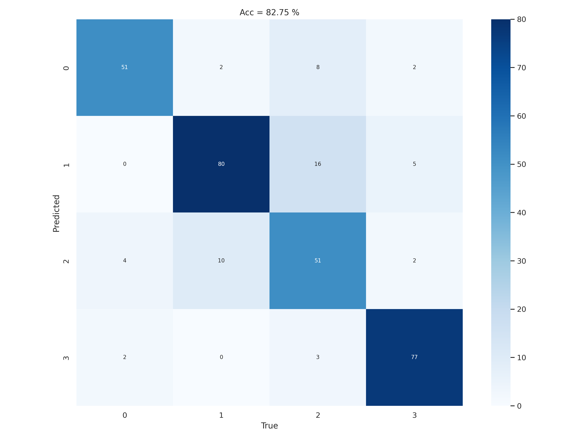
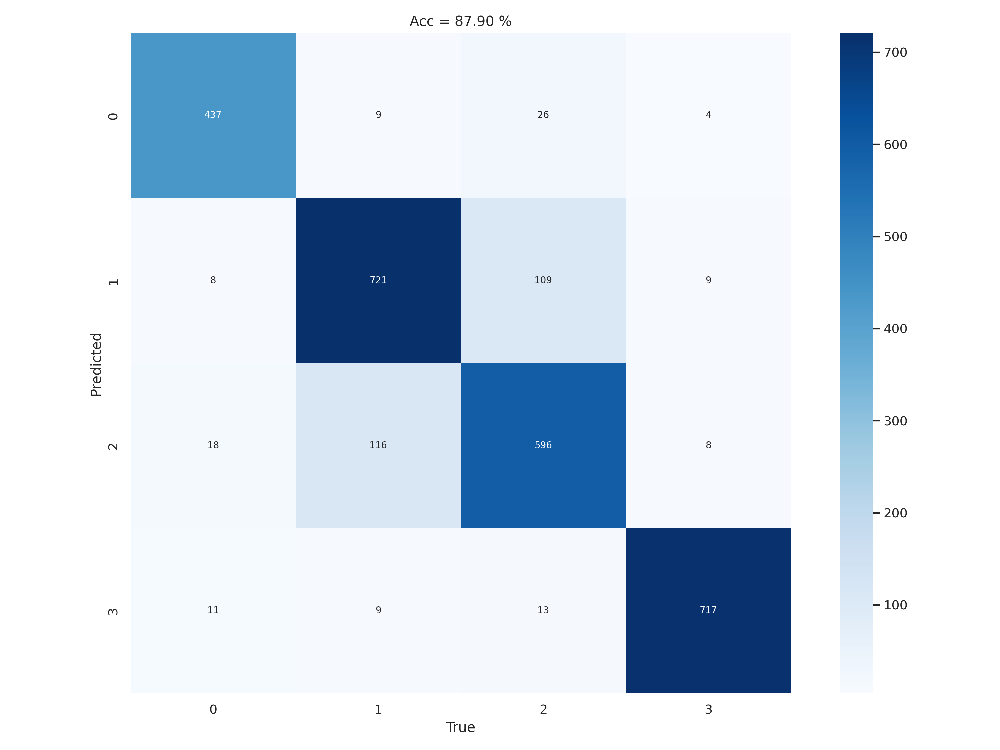

# Flower Recognition with Auto Encoder 
***
Final Project of Machine Learning course
## Member
```buildoutcfg
Tran Chi Cuong
Le Van Thien
Dao Duy Ngu
Nguyen Vu Hoai Duy
Ho Thanh Long
```
## Sumary  
***
- Flower recognition with Auto Encoder + ANN/SVM

## Auto Encoder 
- Left: Original Image, Right: Recontructed Image (Test Set)  
   
     --->    
     --->    
     --->    

## Classification  

<figure>

<figcaption align = "center"><b>Confusion Matrix in Test Set (ANN)</b></figcaption>
</figure>

<figure>

<figcaption align = "center"><b>Confusion Matrix in Test Set (SVM)</b></figcaption>
</figure>

<figure>

<figcaption align = "center"><b>Confusion Matrix in Train Set (ANN)</b></figcaption>
</figure>

<figure>

<figcaption align = "center"><b>Confusion Matrix in Train Set (SVM)</b></figcaption>
</figure>